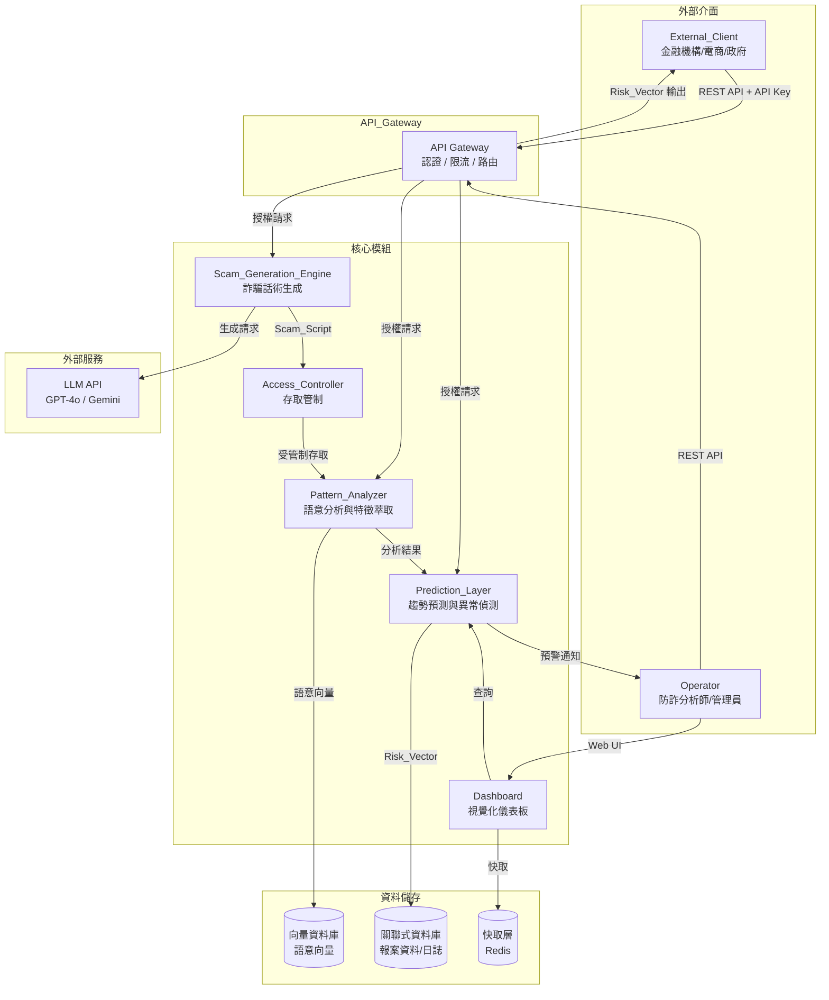
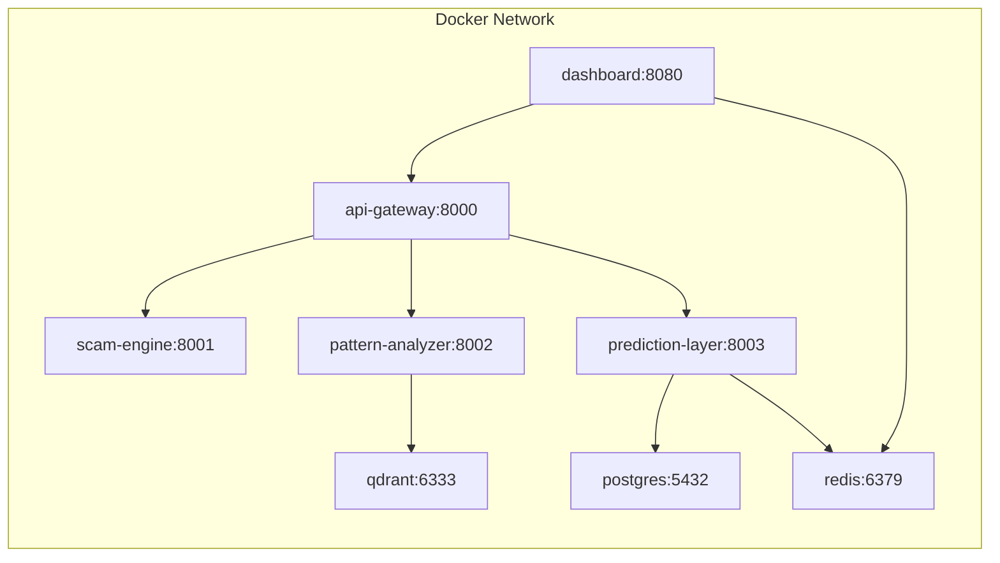
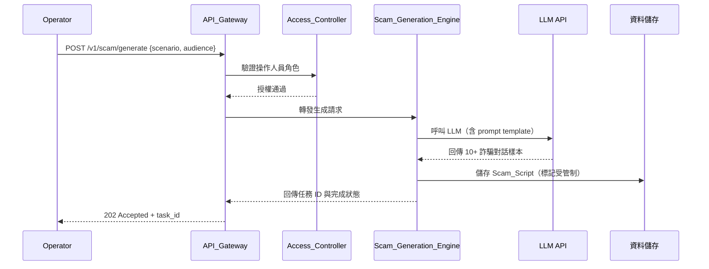
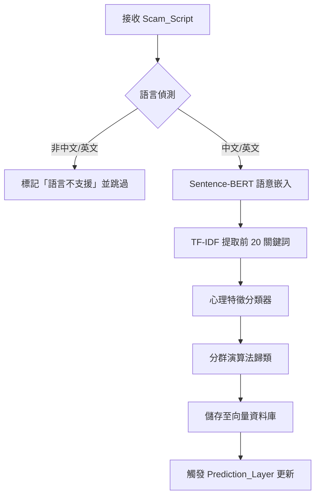
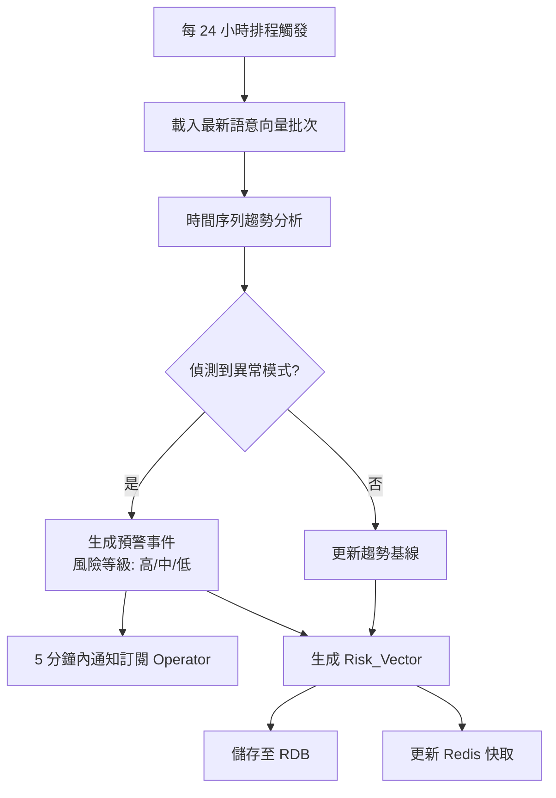

# 技術設計文件：AI 詐騙進化預測系統

## 概覽

AI 詐騙進化預測系統（AI Scam Evolution Prediction System）是一套主動式防詐情報平台，透過生成式 AI 逆向工程詐騙邏輯，預測並生成未來可能出現的詐騙話術變種。系統整合 LLM 生成、NLP 語意分析、時間序列異常偵測與視覺化儀表板，對外提供 RESTful API 供金融機構、電商平台及政府機構串接。

### 設計目標

- 主動預測未知詐騙手法，而非被動依賴黑名單
- 確保詐騙腳本（Scam_Script）受嚴格存取管制，防止內容外洩
- 提供低延遲 API（< 500ms）供外部系統即時查詢風險向量
- 支援持續學習，透過真實報案資料增量微調預測模型

---

## 架構

### 系統架構圖



### 部署架構

系統採用容器化部署（Docker / Docker Compose），各模組獨立服務，透過內部 HTTP/gRPC 通訊。



---

## 元件與介面

### 1. API_Gateway

**職責**：統一入口，負責 API 金鑰驗證、速率限制、請求路由。

**技術選型**：FastAPI + Uvicorn

**對外 API 端點**：

| 方法 | 路徑 | 說明 |
|------|------|------|
| POST | `/v1/scam/generate` | 觸發詐騙話術生成任務 |
| GET  | `/v1/risk-vectors` | 查詢指定時間範圍的 Risk_Vector |
| GET  | `/v1/risk-vectors/{id}` | 查詢單一 Risk_Vector |
| POST | `/v1/data/import` | 匯入真實報案資料 |
| GET  | `/v1/predictions/alerts` | 查詢預警事件列表 |
| GET  | `/v1/health` | 健康檢查 |

**中介軟體**：
- `APIKeyMiddleware`：驗證 `X-API-Key` 標頭，失敗回傳 HTTP 401
- `RateLimitMiddleware`：基於 Redis 滑動視窗計數，超限回傳 HTTP 429 含 `Retry-After` 標頭
- `RequestLoggingMiddleware`：記錄所有請求的時間戳、來源 IP、端點、回應碼

### 2. Scam_Generation_Engine

**職責**：接收操作人員的情境參數，呼叫 LLM 生成詐騙話術變種樣本。

**技術選型**：Python + LangChain + GPT-4o / Gemini API

**核心流程**：



**Prompt 設計原則**：
- 使用 system prompt 明確限定輸出格式（JSON 結構化）
- 每次生成至少 10 種不同語氣/手法的變種
- 輸出包含：話術文本、心理操控類別標籤、目標受眾描述

**錯誤處理**：
- LLM 逾時（> 60s）：記錄錯誤，回傳 `{"error_code": "LLM_TIMEOUT", "description": "..."}`
- LLM API 錯誤：指數退避重試（最多 3 次），仍失敗則回傳結構化錯誤

### 3. Pattern_Analyzer

**職責**：對 Scam_Script 執行語意嵌入、關鍵詞提取、心理特徵標記與分群。

**技術選型**：
- 語意嵌入：`sentence-transformers`（`paraphrase-multilingual-MiniLM-L12-v2`，支援中英文）
- 關鍵詞提取：`scikit-learn` TF-IDF
- 分群：`scikit-learn` K-Means / HDBSCAN（自動決定群數）
- 向量儲存：Qdrant

**分析流程**：



**心理特徵分類器**：
- 採用規則式 + 輕量分類模型混合方式
- 識別五類特徵：信任建立、緊迫感製造、情緒勒索、權威偽裝、利益誘導
- 每份樣本可標記多個特徵類別

### 4. Prediction_Layer

**職責**：時間序列分析、異常偵測、Risk_Vector 生成、預警通知。

**技術選型**：
- 時間序列：`statsmodels` ARIMA / `prophet`
- 異常偵測：`pyod`（Isolation Forest / LOF）
- 排程：`APScheduler`（每 24 小時執行）
- 通知：WebSocket 推播 / Email（SMTP）

**Risk_Vector 生成流程**：



**Risk_Vector 結構**：
- 高風險語意特徵列表
- 對應詐騙類群標籤
- 風險分數（0.0 ~ 1.0）
- 時間戳記與版本號

### 5. Dashboard

**技術選型**：Streamlit（快速原型）或 Vue.js + Chart.js（生產環境）

**頁面模組**：
- 熱詞排行榜：每 24 小時更新，顯示前 20 高頻詐騙熱詞
- 沙盤推演介面：輸入情境參數，即時觀察預測結果
- 受害風險地圖：依年齡層、地區呈現風險指數
- 預警事件列表：即時顯示 Prediction_Layer 輸出的預警

**效能要求**：
- 頁面初始載入 < 3 秒（使用 Redis 快取最新資料）
- 後端不可用時顯示快取資料並標示更新時間

### 6. Access_Controller

**職責**：角色權限驗證、存取日誌記錄、防竄改保護。

**技術選型**：
- 角色管理：RBAC（Role-Based Access Control）
- 日誌儲存：Append-only 資料表（PostgreSQL）+ 雜湊鏈（防竄改）
- 二次驗證：TOTP（`pyotp`）

**角色定義**：

| 角色 | 可存取 Scam_Script | 可匯出 | 批量匯出上限 |
|------|-------------------|--------|-------------|
| 系統管理員 | ✓ | ✓ | 100（超過需 2FA）|
| 詐騙分析師 | ✓ | ✓ | 100（超過需 2FA）|
| 一般操作員 | ✗ | ✗ | - |
| External_Client | ✗ | ✗ | - |

---

## 資料模型

### ScamScript

```python
@dataclass
class ScamScript:
    id: str                          # UUID
    task_id: str                     # 生成任務 ID
    content: str                     # 詐騙對話文本（受管制）
    scenario: str                    # 基礎情境描述
    target_audience: str             # 目標受眾特徵
    psychological_tags: list[str]    # 心理操控特徵標籤
    language: str                    # 偵測語言（zh-TW / en / unsupported）
    is_regulated: bool               # 是否為受管制資料（恆為 True）
    created_at: datetime
    created_by: str                  # 操作人員 ID
```

### SemanticVector

```python
@dataclass
class SemanticVector:
    id: str                          # UUID
    script_id: str                   # 對應 ScamScript ID
    embedding: list[float]           # 384 維語意向量（MiniLM）
    top_keywords: list[str]          # TF-IDF 前 20 關鍵詞
    cluster_label: str               # 分群標籤
    psychological_tags: list[str]    # 心理特徵標籤
    created_at: datetime
```

### RiskVector

```python
@dataclass
class RiskVector:
    id: str                          # UUID
    high_risk_features: list[str]    # 高風險語意特徵列表
    scam_cluster_label: str          # 詐騙類群標籤
    risk_score: float                # 風險分數 0.0 ~ 1.0
    risk_level: str                  # 高 / 中 / 低
    time_range_start: datetime       # 分析時間範圍起始
    time_range_end: datetime         # 分析時間範圍結束
    version: str                     # 模型版本號
    created_at: datetime
```

### AlertEvent

```python
@dataclass
class AlertEvent:
    id: str                          # UUID
    risk_level: str                  # 高 / 中 / 低
    trigger_features: list[str]      # 觸發預警的特徵描述
    risk_vector_id: str              # 關聯 RiskVector ID
    notified_operators: list[str]    # 已通知的操作人員 ID 列表
    notified_at: datetime            # 通知時間
    created_at: datetime
```

### AccessLog

```python
@dataclass
class AccessLog:
    id: str                          # UUID
    operator_id: str                 # 操作人員識別碼
    action: str                      # 操作類型（read / export / bulk_export）
    resource_id: str                 # 存取的資源 ID
    resource_type: str               # 資源類型（scam_script）
    timestamp: datetime
    prev_hash: str                   # 前一筆日誌的雜湊值（防竄改鏈）
    current_hash: str                # 本筆日誌的雜湊值
```

### CaseReport（真實報案資料）

```python
@dataclass
class CaseReport:
    id: str                          # UUID
    source: str                      # 資料來源（警政署 / 民間組織）
    scam_type: str                   # 詐騙類型
    description: str                 # 案件描述（已去識別化）
    reported_at: datetime            # 報案時間
    import_batch_id: str             # 匯入批次 ID
    pii_removed: bool                # 是否已完成去識別化
```

### ModelVersion

```python
@dataclass
class ModelVersion:
    id: str                          # UUID
    version: str                     # 版本號（語意版本）
    accuracy_before: float           # 微調前準確率
    accuracy_after: float            # 微調後準確率
    training_data_count: int         # 訓練資料筆數
    new_cluster_count: int           # 新增詐騙類群數量
    created_at: datetime
    created_by: str                  # 操作人員 ID
    is_active: bool                  # 是否為當前使用版本
```

---

## 正確性屬性

*屬性（Property）是在系統所有合法執行路徑中都應成立的特性或行為，本質上是對系統應做什麼的形式化陳述。屬性作為人類可讀規格與機器可驗證正確性保證之間的橋樑。*

### 屬性 1：生成樣本數量下限

*對於任意* 合法的詐騙情境與目標受眾特徵輸入，Scam_Generation_Engine 回傳的詐騙對話樣本數量應 >= 10，且每個樣本應包含非空的話術文本與心理操控類別標籤。

**驗證需求：1.1**

---

### 屬性 2：LLM 錯誤回應結構完整性

*對於任意* LLM 服務失敗情境（逾時、API 錯誤、網路中斷），Scam_Generation_Engine 回傳的錯誤訊息應包含 `error_code` 與 `description` 兩個非空欄位。

**驗證需求：1.3**

---

### 屬性 3：未授權請求一律拒絕

*對於任意* 未通過 Access_Controller 授權的操作人員請求，Scam_Generation_Engine 應拒絕該請求並回傳授權失敗回應，不得執行任何生成操作。

**驗證需求：1.4**

---

### 屬性 4：Scam_Script 受管制標記不變量

*對於任意* 由 Scam_Generation_Engine 生成的 Scam_Script，其 `is_regulated` 欄位應恆為 `True`，且不可被任何操作修改為 `False`。

**驗證需求：1.5**

---

### 屬性 5：語意向量維度正確性

*對於任意* 語言為繁體中文或英文的 Scam_Script，Pattern_Analyzer 應產生維度為 384 的非零語意向量，且向量中不含 NaN 或 Inf 值。

**驗證需求：2.1**

---

### 屬性 6：TF-IDF 關鍵詞數量上限

*對於任意* 輸入文本，Pattern_Analyzer 提取的關鍵詞列表長度應 <= 20，且列表中不含重複詞彙。

**驗證需求：2.2**

---

### 屬性 7：心理特徵標籤合法性

*對於任意* Scam_Script 的分析結果，所有輸出的心理操控特徵標籤應屬於以下五個合法類別之一：信任建立、緊迫感製造、情緒勒索、權威偽裝、利益誘導。不得出現此五類以外的標籤值。

**驗證需求：2.3**

---

### 屬性 8：分群標籤完整性

*對於任意* 完成語意嵌入的 SemanticVector，其 `cluster_label` 欄位應為非空字串，不得為 `null` 或空字串。

**驗證需求：2.4**

---

### 屬性 9：不支援語言的跳過行為

*對於任意* 語言非繁體中文且非英文的輸入樣本，Pattern_Analyzer 應將其 `language` 欄位標記為 `unsupported`，且不應產生對應的語意向量或關鍵詞。

**驗證需求：2.5**

---

### 屬性 10：預警事件結構完整性

*對於任意* 由異常偵測觸發的預警事件，AlertEvent 應包含合法的風險等級（高/中/低）與至少一個非空的觸發特徵描述，不得出現此三個等級以外的值。

**驗證需求：3.2**

---

### 屬性 11：準確率計算範圍不變量

*對於任意* 預測結果集合與真實報案資料集合，計算出的預測準確率應在 [0.0, 1.0] 閉區間內，且與手動計算（正確預測數 / 總預測數）結果一致。

**驗證需求：3.4**

---

### 屬性 12：格式不符資料拒絕

*對於任意* 不符合系統規範格式的報案資料批次（缺少必要欄位、錯誤資料型別、不支援的格式），Prediction_Layer 應拒絕整批資料並回傳包含具體格式錯誤說明的回應，不得部分匯入。

**驗證需求：3.5**

---

### 屬性 13：Risk_Vector 結構不變量

*對於任意* 由 Prediction_Layer 生成的 Risk_Vector，應包含至少一個高風險語意特徵、非空的詐騙類群標籤，且風險分數應在 [0.0, 1.0] 閉區間內。

**驗證需求：3.6**

---

### 屬性 14：熱詞排行榜排序正確性

*對於任意* 關鍵詞頻率資料集，熱詞排行計算函數輸出的排行榜應按頻率降序排列，且長度 <= 20。

**驗證需求：4.1**

---

### 屬性 15：API 金鑰驗證拒絕無效請求

*對於任意* 不含有效 API 金鑰的 API 請求（空值、格式錯誤、不存在的金鑰、已撤銷的金鑰），API_Gateway 應回傳 HTTP 401 狀態碼，不得執行任何業務邏輯。

**驗證需求：5.3**

---

### 屬性 16：速率限制觸發 HTTP 429

*對於任意* 在 60 秒視窗內超過訂閱方案請求上限的 External_Client，API_Gateway 應回傳 HTTP 429 狀態碼，且回應標頭應包含非零的 `Retry-After` 值。

**驗證需求：5.4**

---

### 屬性 17：Scam_Script 內容不外洩

*對於任意* 透過 API_Gateway 或 Dashboard 對外介面的回應，回應內容不得包含 Scam_Script 的 `content` 欄位（完整對話文本）。

**驗證需求：5.5、6.3**

---

### 屬性 18：角色存取控制

*對於任意* 嘗試存取 Scam_Script 的操作人員，若其角色不為「詐騙分析師」或「系統管理員」，Access_Controller 應拒絕該請求並回傳授權失敗回應。

**驗證需求：6.1**

---

### 屬性 19：存取日誌記錄完整性（Round-Trip）

*對於任意* 對 Scam_Script 的存取操作，操作完成後查詢存取日誌應能找到對應記錄，且記錄包含操作人員識別碼、存取時間與操作類型三個非空欄位。

**驗證需求：6.2**

---

### 屬性 20：批量匯出二次驗證閾值

*對於任意* 嘗試匯出超過 100 份 Scam_Script 的操作，Access_Controller 應要求二次身份驗證（TOTP），且在驗證完成前不得執行匯出操作。

**驗證需求：6.4**

---

### 屬性 21：日誌防竄改雜湊鏈完整性

*對於任意* 存取日誌序列，若任一筆記錄的內容被修改，則從該筆記錄開始的所有後續記錄的雜湊驗證應失敗，確保竄改可被偵測。

**驗證需求：6.5**

---

### 屬性 22：PII 去識別化

*對於任意* 包含個人識別資訊（姓名、電話、身分證字號、地址、電子郵件）的報案資料，去識別化處理後的資料不得包含原始 PII 值。

**驗證需求：7.3**

---

### 屬性 23：模型版本回滾（Round-Trip）

*對於任意* 執行 N 次模型微調後的系統狀態，執行回滾操作應能將系統恢復至前一個版本，且回滾後的 `is_active` 版本應與回滾目標版本一致。

**驗證需求：7.4**

---

### 屬性 24：微調摘要報告完整性

*對於任意* 完成的模型微調操作，系統通知的摘要報告應包含資料筆數（`training_data_count`）、準確率變化（`accuracy_before`、`accuracy_after`）與新增詐騙類群數量（`new_cluster_count`）四個非空欄位。

**驗證需求：7.5**

---

## 錯誤處理

### 錯誤分類與處理策略

| 錯誤類型 | 觸發條件 | 處理策略 | 回傳格式 |
|---------|---------|---------|---------|
| LLM_TIMEOUT | LLM API 回應超過 60 秒 | 指數退避重試（最多 3 次），仍失敗記錄錯誤 | `{"error_code": "LLM_TIMEOUT", "description": "..."}` |
| LLM_API_ERROR | LLM API 回傳 4xx/5xx | 記錄錯誤代碼，回傳結構化錯誤 | `{"error_code": "LLM_API_ERROR", "description": "..."}` |
| UNAUTHORIZED | API 金鑰無效或缺失 | 立即拒絕，不執行業務邏輯 | HTTP 401 |
| RATE_LIMIT_EXCEEDED | 請求頻率超過訂閱上限 | 回傳 429 含重試時間 | HTTP 429 + `Retry-After` |
| UNSUPPORTED_LANGUAGE | 輸入語言非中文/英文 | 標記樣本，跳過分析 | 樣本標記 `language: unsupported` |
| INVALID_DATA_FORMAT | 匯入資料格式不符規範 | 拒絕整批資料 | `{"error_code": "INVALID_FORMAT", "details": [...]}` |
| BACKEND_UNAVAILABLE | 後端服務不可用 | Dashboard 顯示快取資料 | 快取資料 + 更新時間標示 |
| PII_DETECTED | 匯入資料含 PII | 自動去識別化後繼續處理 | 無錯誤，記錄去識別化操作 |

### 重試策略

```python
# 指數退避重試（用於 LLM API 呼叫）
retry_config = {
    "max_attempts": 3,
    "initial_delay_seconds": 1,
    "backoff_multiplier": 2,
    "max_delay_seconds": 30
}
```

### 結構化錯誤回應格式

```json
{
  "error_code": "LLM_TIMEOUT",
  "description": "LLM 服務在 60 秒內未回應",
  "timestamp": "2024-01-01T00:00:00Z",
  "request_id": "uuid-v4",
  "retry_after": 30
}
```

---

## 測試策略

### 雙軌測試方法

本系統採用單元測試與屬性測試並行的雙軌策略，兩者互補：

- **單元測試**：驗證具體範例、邊緣案例與整合點
- **屬性測試**：透過隨機輸入驗證普遍性屬性，覆蓋大量輸入組合

### 屬性測試框架

**選用框架**：`hypothesis`（Python 屬性測試函式庫）

```bash
pip install hypothesis
```

**設定**：每個屬性測試最少執行 100 次迭代

```python
from hypothesis import given, settings, strategies as st

@settings(max_examples=100)
@given(st.text(min_size=1))
def test_property_name(input_text):
    # Feature: ai-scam-evolution-prediction, Property N: <property_text>
    ...
```

### 屬性測試對應表

每個正確性屬性對應一個屬性測試，標記格式：
`# Feature: ai-scam-evolution-prediction, Property {N}: {property_text}`

| 屬性 | 測試函數 | 測試模組 |
|------|---------|---------|
| 屬性 1 | `test_generation_minimum_samples` | `tests/test_scam_engine.py` |
| 屬性 2 | `test_llm_error_response_structure` | `tests/test_scam_engine.py` |
| 屬性 3 | `test_unauthorized_request_rejected` | `tests/test_access_control.py` |
| 屬性 4 | `test_scam_script_regulated_invariant` | `tests/test_scam_engine.py` |
| 屬性 5 | `test_semantic_vector_dimensions` | `tests/test_pattern_analyzer.py` |
| 屬性 6 | `test_tfidf_keyword_count_limit` | `tests/test_pattern_analyzer.py` |
| 屬性 7 | `test_psychological_tag_validity` | `tests/test_pattern_analyzer.py` |
| 屬性 8 | `test_cluster_label_not_empty` | `tests/test_pattern_analyzer.py` |
| 屬性 9 | `test_unsupported_language_skip` | `tests/test_pattern_analyzer.py` |
| 屬性 10 | `test_alert_event_structure` | `tests/test_prediction_layer.py` |
| 屬性 11 | `test_accuracy_score_range` | `tests/test_prediction_layer.py` |
| 屬性 12 | `test_invalid_format_rejected` | `tests/test_prediction_layer.py` |
| 屬性 13 | `test_risk_vector_invariant` | `tests/test_prediction_layer.py` |
| 屬性 14 | `test_hotword_ranking_order` | `tests/test_dashboard.py` |
| 屬性 15 | `test_invalid_api_key_rejected` | `tests/test_api_gateway.py` |
| 屬性 16 | `test_rate_limit_http_429` | `tests/test_api_gateway.py` |
| 屬性 17 | `test_scam_script_not_exposed` | `tests/test_api_gateway.py` |
| 屬性 18 | `test_role_access_control` | `tests/test_access_control.py` |
| 屬性 19 | `test_access_log_round_trip` | `tests/test_access_control.py` |
| 屬性 20 | `test_bulk_export_2fa_threshold` | `tests/test_access_control.py` |
| 屬性 21 | `test_log_hash_chain_integrity` | `tests/test_access_control.py` |
| 屬性 22 | `test_pii_removal` | `tests/test_data_import.py` |
| 屬性 23 | `test_model_version_rollback` | `tests/test_prediction_layer.py` |
| 屬性 24 | `test_finetune_summary_completeness` | `tests/test_prediction_layer.py` |

### 單元測試重點

單元測試聚焦於以下面向，避免與屬性測試重複：

- **整合點**：LLM API 呼叫的 mock 測試、向量資料庫讀寫
- **具體範例**：CSV/JSON 格式匯入（需求 7.1）、Dashboard 快取降級（需求 4.5）
- **邊緣案例**：空輸入、極長文本、特殊字元、Unicode 邊界值

### 測試目錄結構

```
tests/
├── test_scam_engine.py        # Scam_Generation_Engine 測試
├── test_pattern_analyzer.py   # Pattern_Analyzer 測試
├── test_prediction_layer.py   # Prediction_Layer 測試
├── test_api_gateway.py        # API_Gateway 測試
├── test_access_control.py     # Access_Controller 測試
├── test_dashboard.py          # Dashboard 邏輯測試
├── test_data_import.py        # 資料匯入測試
└── conftest.py                # 共用 fixtures
```

### 屬性測試範例

```python
# tests/test_pattern_analyzer.py
from hypothesis import given, settings, strategies as st
from pattern_analyzer import PatternAnalyzer

analyzer = PatternAnalyzer()

@settings(max_examples=100)
@given(st.text(min_size=10, alphabet=st.characters(whitelist_categories=('Lu', 'Ll', 'Nd', 'Zs'))))
def test_tfidf_keyword_count_limit(text):
    # Feature: ai-scam-evolution-prediction, Property 6: TF-IDF 關鍵詞數量上限
    result = analyzer.extract_keywords(text)
    assert len(result) <= 20
    assert len(result) == len(set(result))  # 無重複


@settings(max_examples=100)
@given(st.lists(st.text(min_size=1), min_size=1))
def test_psychological_tag_validity(scripts):
    # Feature: ai-scam-evolution-prediction, Property 7: 心理特徵標籤合法性
    valid_tags = {"信任建立", "緊迫感製造", "情緒勒索", "權威偽裝", "利益誘導"}
    for script in scripts:
        tags = analyzer.classify_psychological_features(script)
        assert all(tag in valid_tags for tag in tags)
```

```python
# tests/test_prediction_layer.py
from hypothesis import given, settings, strategies as st
from prediction_layer import RiskVectorGenerator

generator = RiskVectorGenerator()

@settings(max_examples=100)
@given(
    st.lists(st.floats(min_value=0.0, max_value=1.0), min_size=1),
    st.lists(st.floats(min_value=0.0, max_value=1.0), min_size=1)
)
def test_accuracy_score_range(predictions, actuals):
    # Feature: ai-scam-evolution-prediction, Property 11: 準確率計算範圍不變量
    score = generator.calculate_accuracy(predictions, actuals)
    assert 0.0 <= score <= 1.0
```
