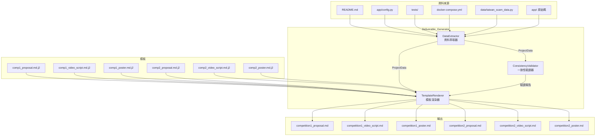
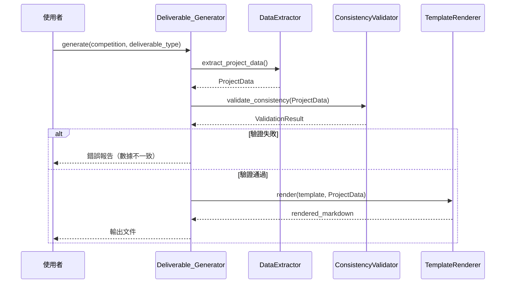
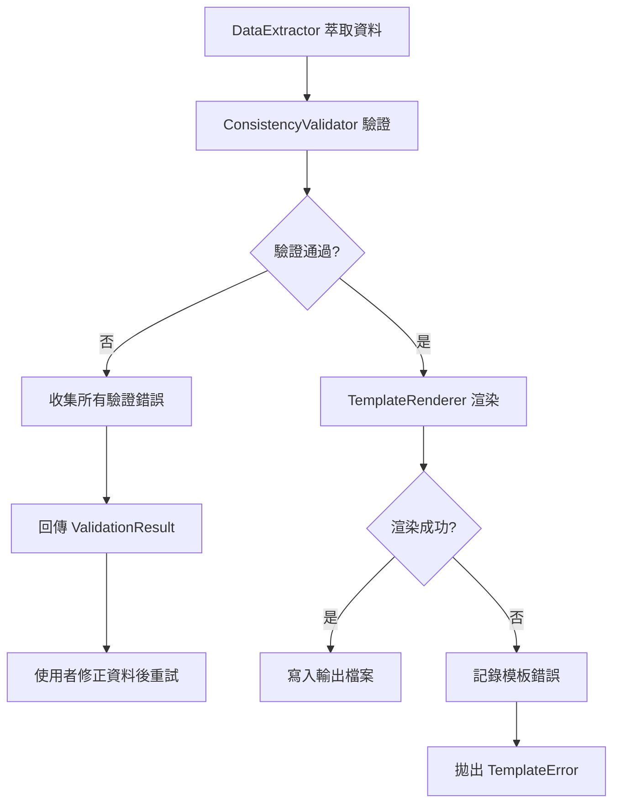

# 技術設計文件：比賽交付物產出系統

## 概覽

本系統為 ScamOracle（AI 詐騙進化預測系統）設計一套自動化交付物產出模組（Deliverable_Generator），負責根據兩場 AI 競賽的不同評審標準，產出六份結構化文件：

| 比賽 | 計畫書 | 影片腳本 | 海報內容 |
|------|--------|---------|---------|
| **比賽一**（AI 應用創意獎 — 問題解決組） | 創新性 + 使用者價值導向 | 5 分鐘產品展示 | 產品情境導向 |
| **比賽二**（AI 應用技術與架構設計大賽） | 系統架構 + 技術深度導向 | 2 分鐘技術展示 | A1 架構圖導向 |

### 設計目標

- 從現有 ScamOracle 程式碼與資料中自動萃取技術數據，確保所有交付物的數據一致性
- 根據兩場比賽截然不同的評審標準，產出風格與重點各異的文件內容
- 確保比賽一聚焦「問題解決敘事」（問題定義 → 解決方案 → 成效展示），比賽二聚焦「技術架構深度」
- 所有文件以繁體中文撰寫，維持一致的品牌識別（ScamOracle — AI 詐騙進化預測系統）

### 設計決策與理由

1. **採用模板引擎 + 資料萃取器架構**：將「資料收集」與「文件渲染」分離，確保同一份技術數據在六份文件中保持一致，避免手動複製貼上造成的不一致。
2. **使用 Jinja2 模板引擎**：Python 生態系中最成熟的模板引擎，支援繁體中文、條件邏輯、迴圈，且團隊已熟悉 Python 技術棧。
3. **靜態文件產出（Markdown）**：交付物為一次性產出的文件，不需要即時互動，Markdown 格式便於後續轉換為 PDF/DOCX。
4. **不使用 LLM 生成文件內容**：比賽文件需要精確的技術數據與特定的敘事結構，LLM 生成容易產生幻覺或數據不一致，改用模板引擎搭配精確資料更可靠。

---

## 架構

### 模組架構圖



### 處理流程



---

## 元件與介面

### 1. DataExtractor（資料萃取器）

**職責**：從 ScamOracle 專案中萃取所有交付物所需的技術數據與統計資訊。

**萃取資料來源與內容**：

| 資料來源 | 萃取內容 |
|---------|---------|
| `README.md` | 專案名稱、副標題、功能頁面數量、API 端點數量、技術棧列表、團隊分工 |
| `pyproject.toml` | Python 版本需求、依賴套件列表 |
| `app/config.py` | LLM 模型名稱、向量維度、資料庫設定 |
| `docker-compose.yml` | Docker 服務列表（PostgreSQL、Redis、Qdrant） |
| `data/taiwan_scam_data.py` | 台灣詐騙統計數據（案件數、損失金額、年增率） |
| `tests/` | 測試檔案數量、測試函數總數 |
| `app/` 各模組 | 模組名稱列表、核心類別與函數簽名 |

**介面定義**：

```python
@dataclass
class ProjectData:
    """專案資料集合，供所有模板共用"""
    # 品牌資訊
    project_name: str                    # "ScamOracle"
    project_subtitle: str                # "AI 詐騙進化預測系統"

    # 技術數據
    test_count: int                      # 409
    embedding_dim: int                   # 384
    dashboard_page_count: int            # 12
    api_endpoint_count: int              # 7
    module_names: list[str]              # 10 個核心模組名稱
    tech_stack: dict[str, str]           # 技術棧對應表
    docker_services: list[str]           # Docker 服務列表

    # 統計數據
    scam_cases_2023: int                 # 83,000
    scam_loss_2023: str                  # "88.2 億元"
    scam_loss_growth_rate: str           # "28%"
    early_warning_hours: int             # 24
    detection_accuracy: str              # "84.7%"

    # AI 模型資訊
    llm_models: list[str]               # ["Meta Llama 3", "Google Gemini"]
    llm_deployment: str                  # "Ollama 本地部署"
    embedding_model: str                 # "paraphrase-multilingual-MiniLM-L12-v2"

    # 心理特徵
    psychological_dimensions: list[str]  # 5 維心理特徵名稱
    scam_dna_description: str            # Scam_DNA 說明文字

    # 團隊分工
    team_members: list[TeamMember]

    # 測試策略
    test_types: dict[str, int]           # {"unit": N, "property": N, "integration": N}


@dataclass
class TeamMember:
    """團隊成員資訊"""
    name: str                            # "Member A" / "Member B"
    responsibilities: list[str]          # 負責範疇列表


class DataExtractor:
    """從專案原始碼與設定檔萃取資料"""

    def extract(self) -> ProjectData:
        """萃取完整專案資料"""
        ...

    def _count_tests(self) -> int:
        """計算測試函數總數"""
        ...

    def _list_modules(self) -> list[str]:
        """列出核心模組名稱"""
        ...

    def _extract_tech_stack(self) -> dict[str, str]:
        """萃取技術棧資訊"""
        ...

    def _extract_scam_statistics(self) -> dict[str, Any]:
        """萃取台灣詐騙統計數據"""
        ...
```

### 2. TemplateRenderer（模板渲染器）

**職責**：使用 Jinja2 模板引擎，將 ProjectData 渲染為六份 Markdown 文件。

**模板設計原則**：
- 比賽一模板：使用者情境故事、產品功能展示、問題解決敘事弧線、非技術語言
- 比賽二模板：系統架構圖、程式碼片段、測試策略、技術參數標註

**介面定義**：

```python
class TemplateRenderer:
    """Jinja2 模板渲染器"""

    def __init__(self, template_dir: str = "templates/competition"):
        self._env = jinja2.Environment(
            loader=jinja2.FileSystemLoader(template_dir),
            autoescape=False,
            keep_trailing_newline=True,
        )

    def render(
        self,
        competition: Literal["competition_1", "competition_2"],
        deliverable_type: Literal["proposal", "video_script", "poster"],
        data: ProjectData,
    ) -> str:
        """
        渲染指定比賽與交付物類型的文件

        Args:
            competition: 比賽編號
            deliverable_type: 交付物類型
            data: 專案資料

        Returns:
            渲染後的 Markdown 文字
        """
        ...

    def render_all(self, data: ProjectData) -> dict[str, str]:
        """
        渲染全部六份交付物

        Returns:
            {文件名稱: 渲染後內容} 的字典
        """
        ...
```

### 3. ConsistencyValidator（一致性驗證器）

**職責**：驗證 ProjectData 中的技術數據一致性，確保所有交付物引用相同的數據。

**驗證規則**：

| 驗證項目 | 規則 | 錯誤訊息 |
|---------|------|---------|
| 測試數量 | `test_count > 0` | 測試數量必須為正整數 |
| 向量維度 | `embedding_dim == 384` | 向量維度必須為 384 |
| 頁面數量 | `dashboard_page_count == 12` | Dashboard 頁面數量必須為 12 |
| API 端點 | `api_endpoint_count == 7` | API 端點數量必須為 7 |
| 模組數量 | `len(module_names) == 10` | 核心模組數量必須為 10 |
| AI 模型 | 不含中國大陸 AI 工具 | AI 模型列表不得包含 DeepSeek 等 |
| 心理特徵 | `len(psychological_dimensions) == 5` | 心理特徵維度必須為 5 |
| 專案名稱 | `project_name == "ScamOracle"` | 專案名稱必須為 ScamOracle |
| 團隊成員 | `len(team_members) == 2` | 團隊成員必須為 2 人 |

**介面定義**：

```python
@dataclass
class ValidationError:
    """驗證錯誤"""
    field: str          # 欄位名稱
    expected: str       # 預期值描述
    actual: str         # 實際值
    message: str        # 錯誤訊息


@dataclass
class ValidationResult:
    """驗證結果"""
    is_valid: bool
    errors: list[ValidationError]


class ConsistencyValidator:
    """交付物資料一致性驗證器"""

    # 禁止使用的 AI 工具名稱
    BANNED_AI_TOOLS: frozenset[str] = frozenset({
        "deepseek", "baidu", "ernie", "qwen", "tongyi",
        "chatglm", "zhipu", "minimax", "baichuan",
    })

    def validate(self, data: ProjectData) -> ValidationResult:
        """
        驗證專案資料一致性

        Args:
            data: 專案資料

        Returns:
            驗證結果，包含是否通過與錯誤列表
        """
        ...

    def _check_banned_ai_tools(self, models: list[str]) -> list[ValidationError]:
        """檢查 AI 模型列表是否包含禁止的工具"""
        ...
```

### 4. DeliverableGenerator（交付物產出器 — 主入口）

**職責**：協調 DataExtractor、ConsistencyValidator、TemplateRenderer 的完整產出流程。

**介面定義**：

```python
class DeliverableGenerator:
    """交付物產出系統主入口"""

    def __init__(
        self,
        extractor: DataExtractor | None = None,
        validator: ConsistencyValidator | None = None,
        renderer: TemplateRenderer | None = None,
    ):
        self._extractor = extractor or DataExtractor()
        self._validator = validator or ConsistencyValidator()
        self._renderer = renderer or TemplateRenderer()

    def generate(
        self,
        competition: Literal["competition_1", "competition_2"],
        deliverable_type: Literal["proposal", "video_script", "poster"],
        output_dir: str = "deliverables/",
    ) -> str:
        """
        產出單一交付物

        Args:
            competition: 比賽編號
            deliverable_type: 交付物類型
            output_dir: 輸出目錄

        Returns:
            輸出檔案路徑

        Raises:
            ConsistencyError: 資料一致性驗證失敗
        """
        ...

    def generate_all(self, output_dir: str = "deliverables/") -> list[str]:
        """
        產出全部六份交付物

        Returns:
            輸出檔案路徑列表
        """
        ...
```

### 5. 模板結構設計

#### 比賽一計畫書模板結構

```
1. 專案摘要
2. 問題背景（台灣詐騙現況 + 話術演化趨勢）
3. 解決方案（ScamOracle 核心理念：以 AI 對抗 AI）
4. 產品功能展示（使用者情境故事）
   4.1 詐騙對話模擬器
   4.2 XAI 話術分析
   4.3 詐騙免疫訓練
   4.4 即時威脅監控
5. 創新亮點
   5.1 Scam_DNA 五維心理特徵量化（圖文說明）
   5.2 MaiAgent 協調運作說明
6. AI 技術應用說明（Meta Llama 3 + Google Gemini）
7. 使用者價值
8. 團隊分工
9. 未來展望
```

#### 比賽二計畫書模板結構（遵循指定四大章節）

```
一、作品及功能簡介
   - 專案摘要、問題背景、核心功能概述
   - 10 個核心模組功能說明

二、作品特色及創意效益描述
   - 「以 AI 對抗 AI」逆向思維
   - Scam_DNA 五維心理特徵量化
   - 409 個自動化測試策略
   - 效能指標與程式碼品質

三、作品系統架構
   - 四層系統架構圖（Input → Engine → Analysis → Output）
   - Docker Compose 三服務架構
   - 技術棧說明

四、人工智慧工具輔助開發使用情形
   - GitHub Copilot 程式碼輔助
   - Prompt Engineering（Ollama）
```

#### 比賽一影片腳本模板結構（5 分鐘）

```
分鏡 1 (0:00-0:30)  — 開場：使用者故事（民眾接到詐騙電話）
分鏡 2 (0:30-1:00)  — 應用介紹：ScamOracle 產品定位與核心功能
分鏡 3 (1:00-1:30)  — 問題現況：台灣詐騙數據視覺化
分鏡 4 (1:30-2:00)  — 「以 AI 對抗 AI」核心理念視覺化
分鏡 5 (2:00-2:45)  — 操作方式：詐騙對話模擬器操作展示
分鏡 6 (2:45-3:15)  — 操作方式：XAI 話術分析高亮效果
分鏡 7 (3:15-3:45)  — 操作方式：話術 DNA 圖譜
分鏡 8 (3:45-4:15)  — 操作方式：詐騙免疫訓練
分鏡 9 (4:15-4:45)  — 預期效果：預警能力與防詐效益
分鏡 10 (4:45-5:00) — 結尾：品牌識別與團隊
```

#### 比賽二影片腳本模板結構（2 分鐘）

```
分鏡 1 (0:00-0:20)  — 開場：專案概述與技術定位
分鏡 2 (0:20-0:50)  — 四層系統架構動畫流程
分鏡 3 (0:50-1:10)  — 程式碼片段展示（LangChain Prompt + S-BERT）
分鏡 4 (1:10-1:25)  — 自動化測試執行畫面（409 測試通過）
分鏡 5 (1:25-1:40)  — Docker Compose + API Swagger UI
分鏡 6 (1:40-1:50)  — AI 輔助開發工具（GitHub Copilot）
分鏡 7 (1:50-2:00)  — 結尾：技術棧總覽與團隊
```

#### 比賽一海報模板結構

```
┌─────────────────────────────────────────┐
│  ScamOracle — AI 詐騙進化預測系統        │  標題區
│  「以 AI 對抗 AI」                       │
├─────────────────────────────────────────┤
│  問題視覺化區（台灣詐騙現況數據）         │  上方 25%
│  83,000 件 | 88.2 億 | 年增 28%          │
├─────────────────────────────────────────┤
│  解決方案概覽                            │  中間 50%
│  ┌──────┐ ┌──────┐ ┌──────┐ ┌──────┐   │
│  │對話模擬│ │XAI分析│ │DNA圖譜│ │免疫訓練│   │
│  └──────┘ └──────┘ └──────┘ └──────┘   │
│  Scam_DNA 五維雷達圖                     │
├─────────────────────────────────────────┤
│  成效數據（預警 24h、準確率 84.7%）       │  下方 25%
│  [Meta Llama 3 & Gemini 徽章]           │
│  團隊分工                                │
└─────────────────────────────────────────┘
```

#### 比賽二海報模板結構（A1: 594mm × 841mm）

```
┌─────────────────────────────────────────┐
│  ScamOracle — AI 詐騙進化預測系統        │  標題區
│  AI 應用技術與架構設計大賽               │
├─────────────────────────────────────────┤
│                                         │
│  ┌─────────────────────────────────┐    │  主視覺 40%+
│  │     四層系統架構流程圖            │    │
│  │  Input → Engine → Analysis →    │    │
│  │  Output                         │    │
│  │  S-BERT 384維 | Isolation Forest│    │
│  │  K-Means | LangChain           │    │
│  └─────────────────────────────────┘    │
│                                         │
├──────────────────┬──────────────────────┤
│  程式碼片段 1     │  程式碼片段 2         │  程式碼區
│  (generator.py)  │  (embedder.py)       │
├──────────────────┴──────────────────────┤
│  測試覆蓋率：409 測試 | PBT | 三類測試    │  品質指標
│  技術棧圖示列                            │
│  [Meta Llama 3 & Gemini 徽章]           │
│  AI 輔助開發 | 團隊分工                   │
└─────────────────────────────────────────┘
```

---

## 資料模型

### ProjectData（核心資料模型）

```python
@dataclass
class ProjectData:
    """
    專案資料集合

    由 DataExtractor 萃取，供所有模板共用。
    所有交付物引用此單一資料來源，確保數據一致性。
    """
    # 品牌資訊
    project_name: str                    # "ScamOracle"
    project_subtitle: str                # "AI 詐騙進化預測系統"

    # 技術數據（需求 7.1 一致性要求）
    test_count: int                      # 409
    embedding_dim: int                   # 384
    dashboard_page_count: int            # 12
    api_endpoint_count: int              # 7
    module_names: list[str]              # 10 個核心模組
    tech_stack: dict[str, str]           # 技術棧
    docker_services: list[str]           # ["PostgreSQL", "Redis", "Qdrant"]

    # 台灣詐騙統計數據
    scam_cases_2023: int                 # 83000
    scam_loss_2023: str                  # "88.2 億元"
    scam_loss_growth_rate: str           # "28%"
    scam_cases_growth_rate: str          # "27%"
    avg_loss_investment: str             # "85 萬元"
    avg_loss_romance: str               # "42 萬元"
    early_warning_hours: int             # 24
    detection_accuracy: str              # "84.7%"

    # AI 模型資訊（需求 7.5 統一描述）
    llm_models: list[str]               # ["Meta Llama 3（透過 Ollama 本地部署）", "Google Gemini"]
    embedding_model: str                 # "paraphrase-multilingual-MiniLM-L12-v2"

    # Scam_DNA 心理特徵
    psychological_dimensions: list[str]  # ["信任建立", "緊迫感製造", "情緒勒索", "權威偽裝", "利益誘導"]

    # 團隊分工（需求 7.6）
    team_members: list[TeamMember]

    # 測試策略（需求 2.3）
    test_types: dict[str, int]           # {"unit": N, "property": N, "integration": N}

    # 系統架構層次
    architecture_layers: list[str]       # ["Input", "Engine", "Analysis", "Output"]
```

### DeliverableOutput（交付物輸出）

```python
@dataclass
class DeliverableOutput:
    """單一交付物輸出結果"""
    competition: str                     # "competition_1" | "competition_2"
    deliverable_type: str                # "proposal" | "video_script" | "poster"
    content: str                         # 渲染後的 Markdown 內容
    file_path: str                       # 輸出檔案路徑
    rendered_at: datetime                # 渲染時間
    data_hash: str                       # ProjectData 的雜湊值（用於追蹤資料版本）
```

### VideoScene（影片分鏡）

```python
@dataclass
class VideoScene:
    """影片腳本分鏡"""
    scene_number: int                    # 分鏡編號
    time_start: str                      # 起始時間碼 "MM:SS"
    time_end: str                        # 結束時間碼 "MM:SS"
    visual_description: str              # 畫面描述
    narration: str                       # 旁白文字
    subtitle_hint: str                   # 字幕提示（比賽一）或技術標註（比賽二）
    section_tag: str                     # 段落標記（"應用介紹" | "操作方式" | "預期效果"）
```

### PosterSection（海報區塊）

```python
@dataclass
class PosterSection:
    """海報版面區塊"""
    section_name: str                    # 區塊名稱
    position: str                        # 版面位置（"top" | "middle" | "bottom"）
    area_percentage: float               # 佔海報面積百分比
    content_elements: list[str]          # 內容元素列表
    visual_type: str                     # 視覺類型（"text" | "chart" | "code" | "image" | "badge"）
```

---

## 正確性屬性

*屬性（Property）是在系統所有合法執行路徑中都應成立的特性或行為，本質上是對系統應做什麼的形式化陳述。屬性作為人類可讀規格與機器可驗證正確性保證之間的橋樑。*

### 屬性 1：計畫書必要章節完整性

*對於任意*合法的 ProjectData 與比賽編號，TemplateRenderer 渲染的計畫書應包含該比賽規定的所有必要章節標題。比賽一需包含 9 個章節（專案摘要、問題背景、解決方案、產品功能展示、創新亮點、使用者價值、AI 技術應用說明、團隊分工、未來展望）；比賽二需包含 4 個指定章節（一、作品及功能簡介；二、作品特色及創意效益描述；三、作品系統架構；四、人工智慧工具輔助開發使用情形）。

**驗證需求：1.1, 2.1**

---

### 屬性 2：禁止使用中國大陸 AI 工具

*對於任意* ProjectData 中的 llm_models 列表，ConsistencyValidator 應拒絕包含任何禁止 AI 工具名稱（如 DeepSeek、Baidu ERNIE、Qwen、ChatGLM 等）的資料，且所有六份交付物的渲染輸出中不得出現禁止工具名稱。

**驗證需求：1.5, 2.6**

---

### 屬性 3：影片腳本時長正確性

*對於任意*合法的 ProjectData，比賽一影片腳本的所有分鏡時間碼總和應等於 5 分鐘（300 秒），比賽二影片腳本的所有分鏡時間碼總和應等於 2 分鐘（120 秒），且每個分鏡的結束時間碼應大於起始時間碼。

**驗證需求：3.1, 4.1**

---

### 屬性 4：跨交付物資料一致性

*對於任意*合法的 ProjectData，渲染全部六份交付物後，所有文件中引用的技術數據（測試數量、向量維度、Dashboard 頁面數、API 端點數）、專案名稱（ScamOracle）、副標題（AI 詐騙進化預測系統）、以及團隊成員資訊應完全一致，不得出現數值或名稱不匹配的情況。

**驗證需求：7.1, 7.2, 7.6**

---

### 屬性 5：ProjectData 欄位渲染完整性

*對於任意*合法的 ProjectData，渲染後的交付物應包含 ProjectData 中所有對應欄位的值：比賽二計畫書應包含所有 module_names 中的模組名稱、所有 architecture_layers 中的架構層次名稱、所有 docker_services 中的服務名稱；比賽二海報應包含所有 tech_stack 中的技術名稱。

**驗證需求：2.2, 2.4, 6.6**

---

### 屬性 6：比賽二海報架構圖面積下限

*對於任意*合法的 ProjectData，比賽二海報中系統架構流程圖區塊的 area_percentage 應 >= 40%，確保架構圖為海報主視覺。

**驗證需求：6.2**

---

## 錯誤處理

### 錯誤分類與處理策略

| 錯誤類型 | 觸發條件 | 處理策略 | 回傳格式 |
|---------|---------|---------|---------|
| `CONSISTENCY_ERROR` | ProjectData 中的技術數據不一致（如 embedding_dim ≠ 384） | 拒絕渲染，回傳驗證錯誤列表 | `ValidationResult(is_valid=False, errors=[...])` |
| `BANNED_AI_TOOL` | llm_models 包含禁止的 AI 工具 | 拒絕渲染，回傳具體違規工具名稱 | `ValidationError(field="llm_models", ...)` |
| `TEMPLATE_NOT_FOUND` | 指定的模板檔案不存在 | 拋出 FileNotFoundError，記錄缺失模板路徑 | Python 例外 |
| `TEMPLATE_RENDER_ERROR` | Jinja2 模板渲染失敗（變數缺失、語法錯誤） | 拋出 TemplateError，記錄模板名稱與錯誤位置 | Python 例外 |
| `DATA_EXTRACTION_ERROR` | 無法從專案檔案萃取資料（檔案缺失、格式變更） | 使用預設值填充，記錄警告 | 日誌警告 + 預設值 |
| `OUTPUT_WRITE_ERROR` | 無法寫入輸出檔案（權限不足、磁碟空間不足） | 拋出 IOError，記錄目標路徑 | Python 例外 |

### 驗證失敗處理流程



### 資料萃取降級策略

當專案檔案結構變更導致萃取失敗時，DataExtractor 採用以下降級策略：

| 資料來源 | 降級行為 |
|---------|---------|
| `README.md` 缺失 | 使用硬編碼預設值（project_name="ScamOracle"） |
| `tests/` 目錄缺失 | test_count 設為 0，記錄警告 |
| `docker-compose.yml` 缺失 | docker_services 設為空列表，記錄警告 |
| `data/taiwan_scam_data.py` 缺失 | 使用硬編碼統計數據 |

---

## 測試策略

### 雙軌測試方法

本模組採用單元測試與屬性測試並行的雙軌策略：

- **單元測試**：驗證具體範例（特定模板渲染結果）、邊緣案例（空資料、缺失欄位）、整合點（檔案讀寫）
- **屬性測試**：透過隨機生成 ProjectData 驗證普遍性屬性（一致性、完整性、格式正確性）

### 屬性測試框架

**選用框架**：`hypothesis`（Python 屬性測試函式庫，專案已使用）

**設定**：每個屬性測試最少執行 100 次迭代

```python
from hypothesis import given, settings, strategies as st

@settings(max_examples=100)
@given(project_data=st_project_data())
def test_property_name(project_data):
    # Feature: competition-deliverables, Property N: <property_text>
    ...
```

### 屬性測試對應表

| 屬性 | 測試函數 | 測試模組 |
|------|---------|---------|
| 屬性 1 | `test_proposal_required_sections` | `tests/test_deliverable_generator.py` |
| 屬性 2 | `test_banned_ai_tools_rejected` | `tests/test_deliverable_generator.py` |
| 屬性 3 | `test_video_script_duration` | `tests/test_deliverable_generator.py` |
| 屬性 4 | `test_cross_deliverable_consistency` | `tests/test_deliverable_generator.py` |
| 屬性 5 | `test_project_data_fields_rendered` | `tests/test_deliverable_generator.py` |
| 屬性 6 | `test_comp2_poster_architecture_area` | `tests/test_deliverable_generator.py` |

### 單元測試重點

單元測試聚焦於以下面向，避免與屬性測試重複：

- **具體範例**：
  - 比賽一計畫書包含 "MaiAgent" 描述（需求 1.2）
  - 比賽一計畫書包含 4 個核心功能名稱（需求 1.3）
  - 比賽一計畫書包含 Scam_DNA 五維說明（需求 1.4）
  - 比賽一計畫書包含「以 AI 對抗 AI」（需求 1.6）
  - 比賽一影片腳本包含「應用介紹」「操作方式」「預期效果」三段（需求 3.2, 3.3, 3.4）
  - 比賽一影片腳本以使用者故事開場（需求 3.5）
  - 比賽一影片腳本包含至少 4 個功能展示（需求 3.6）
  - 比賽二影片腳本包含至少 2 段程式碼片段（需求 4.3）
  - 比賽二影片腳本包含測試執行畫面（需求 4.4）
  - 比賽二影片腳本包含 Docker + Swagger 展示（需求 4.6）
  - 比賽一海報包含五維雷達圖說明（需求 5.3）
  - 比賽二海報包含 A1 尺寸標註（需求 6.1）
  - 比賽二海報包含至少 2 個程式碼片段（需求 6.4）
  - 比賽二海報包含測試品質指標（需求 6.5）
  - AI 模型完整描述格式（需求 7.5）

- **邊緣案例**：
  - ProjectData 中 module_names 為空列表
  - ProjectData 中 tech_stack 為空字典
  - 模板檔案缺失時的錯誤處理
  - 輸出目錄不存在時的自動建立

- **整合測試**：
  - 完整 generate_all() 流程（萃取 → 驗證 → 渲染 → 寫入）
  - DataExtractor 從實際專案檔案萃取資料

### 屬性測試範例

```python
# tests/test_deliverable_generator.py
from hypothesis import given, settings, strategies as st

# 自訂 ProjectData 生成策略
@st.composite
def st_project_data(draw):
    """生成隨機但合法的 ProjectData"""
    return ProjectData(
        project_name="ScamOracle",
        project_subtitle="AI 詐騙進化預測系統",
        test_count=draw(st.integers(min_value=1, max_value=1000)),
        embedding_dim=384,
        dashboard_page_count=12,
        api_endpoint_count=7,
        module_names=draw(st.lists(
            st.text(min_size=1, max_size=30, alphabet=st.characters(whitelist_categories=('L',))),
            min_size=1, max_size=15,
        )),
        tech_stack=draw(st.dictionaries(
            st.text(min_size=1, max_size=20),
            st.text(min_size=1, max_size=50),
            min_size=1, max_size=10,
        )),
        docker_services=draw(st.lists(
            st.text(min_size=1, max_size=20),
            min_size=1, max_size=5,
        )),
        # ... 其他欄位
    )


@settings(max_examples=100)
@given(data=st_project_data())
def test_cross_deliverable_consistency(data):
    """
    Feature: competition-deliverables, Property 4:
    跨交付物資料一致性
    """
    renderer = TemplateRenderer()
    outputs = renderer.render_all(data)

    # 所有文件中的測試數量應一致
    for name, content in outputs.items():
        if str(data.test_count) in content:
            assert content.count(str(data.test_count)) >= 1

    # 所有文件中的專案名稱應一致
    for name, content in outputs.items():
        assert "ScamOracle" in content
        assert "AI 詐騙進化預測系統" in content


@settings(max_examples=100)
@given(
    models=st.lists(
        st.sampled_from(["deepseek", "baidu-ernie", "qwen-72b", "chatglm"]),
        min_size=1, max_size=3,
    )
)
def test_banned_ai_tools_rejected(models):
    """
    Feature: competition-deliverables, Property 2:
    禁止使用中國大陸 AI 工具
    """
    validator = ConsistencyValidator()
    data = make_project_data(llm_models=models)
    result = validator.validate(data)
    assert not result.is_valid
    assert any(e.field == "llm_models" for e in result.errors)
```

### 測試目錄結構

```
tests/
├── test_deliverable_generator.py  # 交付物產出系統測試（屬性測試 + 單元測試）
├── ...（既有測試檔案）
└── conftest.py                    # 共用 fixtures
```
