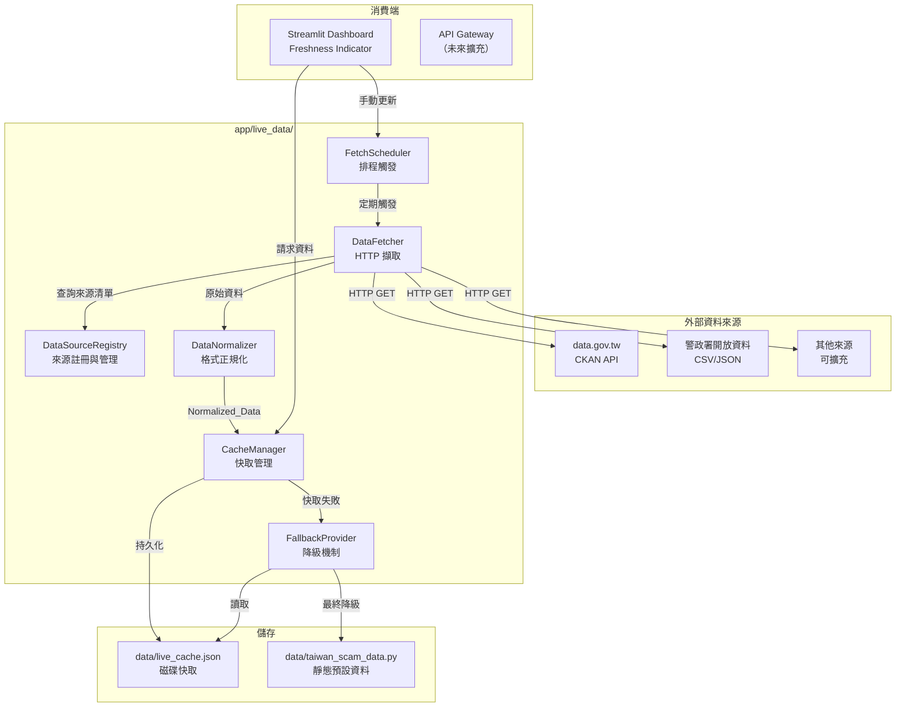
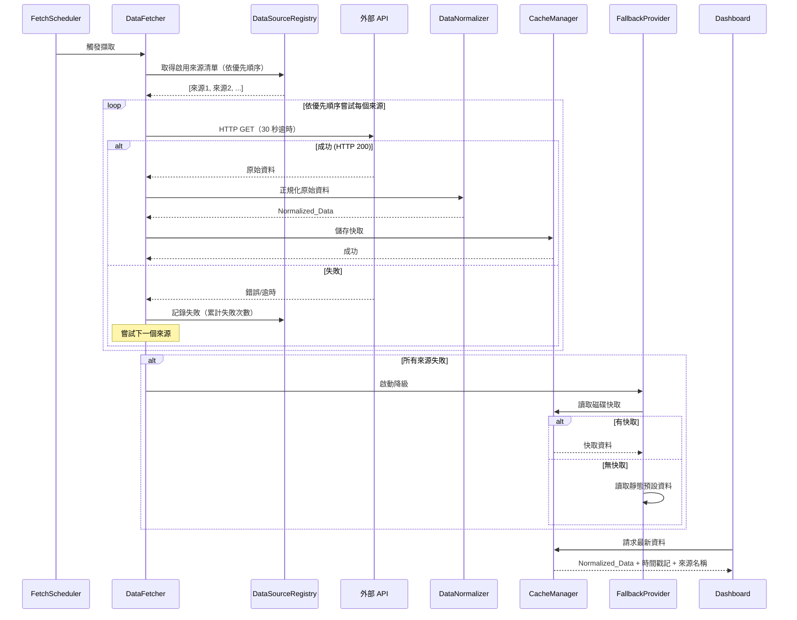

# 設計文件：即時資料自動更新 (Live Data Auto-Update)

## 概述 (Overview)

本設計將系統從硬編碼的靜態詐騙統計資料（`data/taiwan_scam_data.py`）轉換為可自動從外部來源擷取最新台灣詐騙統計資料的動態架構。

核心設計決策：
- **新增獨立模組** `app/live_data/`，不修改現有模組的核心邏輯，僅在 Dashboard 層替換資料來源
- **復用現有 APScheduler 模式**（`app/prediction_layer/scheduler.py`），建立獨立的 `FetchScheduler`
- **擴充現有快取機制**（`app/dashboard/page_modules/cache.py`），新增磁碟持久化能力
- **Fallback 鏈**：外部 API → 磁碟快取 → `data/taiwan_scam_data.py` 靜態資料

技術棧：
- HTTP 客戶端：`httpx`（已在 requirements.txt 中）
- 排程：`apscheduler`（已在 requirements.txt 中）
- 資料驗證：`pydantic`（已在 requirements.txt 中）
- 快取持久化：JSON 檔案寫入 `data/` 目錄
- 測試：`pytest` + `hypothesis`（已在 requirements.txt 中）

## 架構 (Architecture)



### 資料流程



## 元件與介面 (Components and Interfaces)

### 1. DataSourceRegistry（資料來源註冊表）

**檔案位置**：`app/live_data/registry.py`

```python
@dataclass
class DataSourceConfig:
    """單一資料來源設定"""
    name: str                    # 來源名稱，如 "data.gov.tw"
    url: str                     # 端點 URL
    data_format: str             # "json" 或 "csv"
    priority: int                # 優先順序（數值越小越優先）
    enabled: bool = True         # 啟用狀態
    consecutive_failures: int = 0  # 連續失敗次數
    disabled_until: datetime | None = None  # 暫時停用到期時間

class DataSourceRegistry:
    """管理所有外部資料來源端點"""
    
    def __init__(self, sources: list[DataSourceConfig] | None = None) -> None: ...
    def get_active_sources(self) -> list[DataSourceConfig]: ...
    def record_failure(self, source_name: str) -> None: ...
    def record_success(self, source_name: str) -> None: ...
    def _check_auto_recovery(self) -> None: ...
```

**設計決策**：
- 來源清單透過 `app/config.py` 的 `Settings` 類別管理，支援環境變數覆寫
- 連續失敗 3 次自動停用 1 小時，到期後自動恢復
- `get_active_sources()` 回傳依優先順序排序的啟用來源

### 2. DataFetcher（資料擷取器）

**檔案位置**：`app/live_data/fetcher.py`

```python
@dataclass
class FetchResult:
    """單次擷取結果"""
    source_name: str
    fetched_at: datetime
    success: bool
    http_status: int | None = None
    error_message: str | None = None
    record_count: int | None = None
    raw_data: Any = None

class DataFetcher:
    """從外部來源擷取詐騙統計資料"""
    
    def __init__(
        self,
        registry: DataSourceRegistry,
        normalizer: DataNormalizer,
        cache_manager: CacheManager,
        timeout_seconds: int = 30,
    ) -> None: ...
    
    async def fetch(self) -> FetchResult: ...
    def get_recent_results(self, limit: int = 100) -> list[FetchResult]: ...
    @property
    def consecutive_failure_count(self) -> int: ...
```

**設計決策**：
- 使用 `httpx.AsyncClient` 進行非同步 HTTP 請求，單一來源逾時 30 秒
- 依優先順序逐一嘗試來源，第一個成功即停止
- 保留最近 100 筆 `FetchResult` 紀錄（環形緩衝區）
- 連續 3 次排程擷取失敗時記錄 ERROR 日誌

### 3. DataNormalizer（資料正規化器）

**檔案位置**：`app/live_data/normalizer.py`

```python
class NormalizedData(BaseModel):
    """正規化後的統一資料格式"""
    scam_cases_by_region: dict[str, int]          # 各縣市詐騙案件數
    scam_type_stats: dict[str, ScamTypeStat]      # 各詐騙類型統計
    monthly_trend: list[MonthlyTrendEntry]         # 月度趨勢
    victim_age_distribution: dict[str, float]      # 年齡層受害比例
    annual_stats: dict[str, AnnualStat]            # 年度總損失
    source_name: str                               # 資料來源名稱
    fetched_at: datetime                           # 擷取時間 (ISO 8601)

class ScamTypeStat(BaseModel):
    cases: int
    avg_loss_ntd: int
    trend: str

class MonthlyTrendEntry(BaseModel):
    month: str          # "YYYY-MM"
    cases: int
    amount_billion: float

class AnnualStat(BaseModel):
    total_cases: int
    total_loss_billion: float

# 解析器型別
ParserFunc = Callable[[Any], NormalizedData]

class DataNormalizer:
    """將不同來源的原始資料轉換為統一格式"""
    
    def __init__(self) -> None: ...
    def register_parser(self, source_format: str, parser: ParserFunc) -> None: ...
    def normalize(self, raw_data: Any, source_format: str, source_name: str) -> NormalizedData: ...
    def validate(self, data: NormalizedData) -> list[str]: ...
```

**設計決策**：
- 使用 Pydantic `BaseModel` 定義 `NormalizedData`，自動獲得 JSON 序列化/反序列化與驗證
- 解析器註冊機制：`register_parser(format, func)` 允許新增來源格式而不修改核心邏輯
- 內建 2 個解析器：`json_gov_parser`（政府開放資料 JSON）、`csv_stats_parser`（CSV 統計報表）
- 缺失欄位以最近一次快取資料填補，並記錄日誌
- 驗證規則：數值非負、比例欄位總和介於 0.99~1.01

### 4. FetchScheduler（擷取排程器）

**檔案位置**：`app/live_data/scheduler.py`

```python
class FetchScheduler:
    """基於 APScheduler 的資料擷取排程器"""
    
    def __init__(
        self,
        fetcher: DataFetcher,
        interval_hours: int = 6,
    ) -> None: ...
    
    def start(self) -> None: ...
    def stop(self) -> None: ...
    def trigger_now(self) -> None: ...
    
    @property
    def is_running(self) -> bool: ...
    
    @staticmethod
    def validate_interval(value: int) -> int: ...
```

**設計決策**：
- 復用 `PredictionScheduler` 的設計模式（`BackgroundScheduler` + `IntervalTrigger`）
- 預設間隔 6 小時，透過 `DATA_FETCH_INTERVAL_HOURS` 環境變數設定
- 有效範圍 1~168 小時，超出範圍記錄警告並使用預設值
- 啟動時立即觸發一次擷取
- 使用 `max_instances=1` 防止任務重疊執行

### 5. CacheManager（快取管理器）

**檔案位置**：`app/live_data/cache_manager.py`

```python
@dataclass
class CachedData:
    """快取資料包裝"""
    data: NormalizedData
    cached_at: datetime
    source_name: str
    is_fallback: bool = False

class CacheManager:
    """管理 Normalized_Data 的記憶體與磁碟快取"""
    
    def __init__(self, cache_file_path: str = "data/live_cache.json") -> None: ...
    
    def store(self, data: NormalizedData) -> None: ...
    def load(self) -> CachedData | None: ...
    def get_freshness_info(self) -> FreshnessInfo: ...
    
    def _persist_to_disk(self, data: NormalizedData) -> None: ...
    def _load_from_disk(self) -> CachedData | None: ...
```

**設計決策**：
- 雙層快取：記憶體（快速存取）+ 磁碟 JSON 檔案（持久化）
- 磁碟快取路徑：`data/live_cache.json`
- 寫入時同時更新記憶體與磁碟
- 讀取時優先記憶體，記憶體為空時從磁碟載入
- 系統重啟後自動從磁碟恢復快取

### 6. FallbackProvider（降級提供者）

**檔案位置**：`app/live_data/fallback.py`

```python
class FallbackProvider:
    """當所有外部來源不可用時提供降級資料"""
    
    def __init__(self, cache_manager: CacheManager) -> None: ...
    
    def get_data(self) -> CachedData: ...
    
    @staticmethod
    def _load_static_defaults() -> NormalizedData: ...
```

**設計決策**：
- 降級順序：磁碟快取 → 靜態預設資料（`data/taiwan_scam_data.py`）
- 靜態預設資料轉換為 `NormalizedData` 格式，`source_name` 標記為「靜態預設資料」
- 永遠不會回傳空值，確保 Dashboard 始終有資料可顯示

### 7. FreshnessIndicator（新鮮度指示器）

**整合位置**：`app/dashboard/page_modules/freshness.py` + Dashboard 頁面

```python
@dataclass
class FreshnessInfo:
    """資料新鮮度資訊"""
    source_name: str
    fetched_at: datetime | None
    is_fresh: bool          # 來自最新擷取
    is_cached: bool         # 來自快取
    is_static: bool         # 來自靜態預設資料
    cache_age_hours: float  # 快取年齡（小時）

def render_freshness_indicator(info: FreshnessInfo) -> str:
    """產生 Streamlit 可用的 HTML 新鮮度指示器"""
    ...
```

**設計決策**：
- 四種顯示狀態：綠色（最新）、黃色（快取 <24h）、紅色（快取 ≥24h）、灰色（靜態）
- 「立即更新」按鈕觸發 `FetchScheduler.trigger_now()`
- 整合至 Dashboard 頂部，所有頁面共用

### 8. 設定擴充

**修改檔案**：`app/config.py`

```python
# 新增至 Settings 類別
data_fetch_interval_hours: int = Field(
    default=6, description="資料擷取排程間隔（小時）"
)
data_fetch_timeout_seconds: int = Field(
    default=30, description="單一來源 HTTP 請求逾時（秒）"
)
data_cache_file_path: str = Field(
    default="data/live_cache.json", description="快取持久化檔案路徑"
)
data_source_failure_threshold: int = Field(
    default=3, description="來源連續失敗停用閾值"
)
data_source_recovery_hours: int = Field(
    default=1, description="來源停用後自動恢復時間（小時）"
)
```

## 資料模型 (Data Models)

### NormalizedData（核心資料模型）

```python
class ScamTypeStat(BaseModel):
    """詐騙類型統計"""
    cases: int = Field(ge=0)
    avg_loss_ntd: int = Field(ge=0)
    trend: str  # "上升" | "下降" | "穩定"

class MonthlyTrendEntry(BaseModel):
    """月度趨勢條目"""
    month: str  # "YYYY-MM" 格式
    cases: int = Field(ge=0)
    amount_billion: float = Field(ge=0)

class AnnualStat(BaseModel):
    """年度統計"""
    total_cases: int = Field(ge=0)
    total_loss_billion: float = Field(ge=0)

class NormalizedData(BaseModel):
    """正規化後的統一詐騙統計資料"""
    scam_cases_by_region: dict[str, int]
    scam_type_stats: dict[str, ScamTypeStat]
    monthly_trend: list[MonthlyTrendEntry]
    victim_age_distribution: dict[str, float]
    annual_stats: dict[str, AnnualStat]
    source_name: str
    fetched_at: datetime

    @model_validator(mode="after")
    def validate_non_negative_regions(self) -> "NormalizedData":
        for region, count in self.scam_cases_by_region.items():
            if count < 0:
                raise ValueError(f"縣市 {region} 案件數不可為負數: {count}")
        return self

    @model_validator(mode="after")
    def validate_age_distribution_sum(self) -> "NormalizedData":
        total = sum(self.victim_age_distribution.values())
        if not (0.99 <= total <= 1.01):
            raise ValueError(f"年齡層比例總和 {total} 不在 0.99~1.01 範圍內")
        return self
```

### FetchResult（擷取結果紀錄）

```python
class FetchResult(BaseModel):
    """單次資料擷取結果"""
    source_name: str
    fetched_at: datetime
    success: bool
    http_status: int | None = None
    error_message: str | None = None
    record_count: int | None = None
```

### DataSourceConfig（資料來源設定）

```python
class DataSourceConfig(BaseModel):
    """資料來源設定"""
    name: str
    url: str
    data_format: Literal["json", "csv"]
    priority: int = Field(ge=0)
    enabled: bool = True
```

### 快取持久化格式

`data/live_cache.json` 檔案結構：

```json
{
  "data": { /* NormalizedData JSON */ },
  "cached_at": "2024-01-15T08:30:00+08:00",
  "source_name": "data.gov.tw",
  "version": 1
}
```


## 正確性屬性 (Correctness Properties)

*屬性（Property）是一種在系統所有有效執行中都應成立的特徵或行為——本質上是對系統應做之事的形式化陳述。屬性是人類可讀規格與機器可驗證正確性保證之間的橋樑。*

### Property 1: 來源優先順序排序

*For any* 包含任意數量資料來源（含不同優先順序與啟用狀態組合）的 DataSourceRegistry，`get_active_sources()` 回傳的清單 SHALL 僅包含 `enabled=True` 的來源，且依 `priority` 欄位由小到大排序。

**Validates: Requirements 2.3**

### Property 2: 來源失敗狀態機

*For any* DataSourceRegistry 中的資料來源，連續呼叫 `record_failure()` 達到 3 次後，該來源 SHALL 被標記為暫時停用（不出現在 `get_active_sources()` 結果中）。在停用期間呼叫 `record_success()` 或等待 1 小時後，該來源 SHALL 恢復啟用狀態。

**Validates: Requirements 2.4**

### Property 3: 正規化器產生有效輸出

*For any* 符合預期格式的原始資料，`DataNormalizer.normalize()` SHALL 產生一個通過 Pydantic 驗證的 `NormalizedData` 實例，包含所有必要欄位（各縣市案件數、詐騙類型統計、月度趨勢、年齡層比例、年度統計、來源名稱、擷取時間）。

**Validates: Requirements 3.1, 3.2**

### Property 4: 缺失欄位快取填補

*For any* 缺少部分欄位的原始資料，若存在最近一次成功快取，`DataNormalizer` SHALL 以快取中對應欄位的值填補所有缺失欄位，使輸出的 `NormalizedData` 包含完整欄位。

**Validates: Requirements 3.3**

### Property 5: 資料驗證規則

*For any* `NormalizedData` 實例，所有 `scam_cases_by_region` 中的案件數 SHALL 為非負整數，且 `victim_age_distribution` 中所有比例值的總和 SHALL 介於 0.99 至 1.01 之間（含容差）。不符合此規則的資料 SHALL 被驗證器拒絕。

**Validates: Requirements 3.4**

### Property 6: NormalizedData JSON 往返

*For any* 有效的 `NormalizedData` 物件，將其序列化為 JSON 字串再反序列化回 `NormalizedData` SHALL 產生與原始物件等價的結果。

**Validates: Requirements 3.5**

### Property 7: 排程間隔驗證

*For any* 整數值，`FetchScheduler.validate_interval()` SHALL 在值介於 1 至 168 時回傳該值本身，在值超出此範圍時回傳預設值 6。

**Validates: Requirements 4.3, 4.4**

### Property 8: 快取磁碟持久化往返

*For any* 有效的 `NormalizedData` 物件，透過 `CacheManager` 儲存至磁碟後再從磁碟載入，SHALL 產生與原始物件等價的資料。

**Validates: Requirements 5.4, 5.5**

### Property 9: 新鮮度指示器渲染

*For any* `FreshnessInfo` 物件，`render_freshness_indicator()` SHALL 依據以下規則產生對應格式：
- 若 `is_fresh=True`：輸出包含「✅」與來源名稱
- 若 `is_cached=True` 且 `cache_age_hours < 24`：輸出包含「⚠️」與小時數
- 若 `is_cached=True` 且 `cache_age_hours >= 24`：輸出包含「🔴」與天數
- 若 `is_static=True`：輸出包含「📋」

**Validates: Requirements 6.2, 6.3, 6.4, 6.5**

### Property 10: FetchResult 環形緩衝區

*For any* 長度為 N 的 FetchResult 序列（N ≥ 0），`DataFetcher.get_recent_results(100)` 回傳的清單長度 SHALL 不超過 100，且當 N > 100 時 SHALL 僅包含最近的 100 筆紀錄。

**Validates: Requirements 7.2**

## 錯誤處理 (Error Handling)

### HTTP 請求錯誤

| 錯誤類型 | 處理方式 |
|---------|---------|
| 連線逾時（>30s） | 記錄 WARNING 日誌，嘗試下一來源 |
| HTTP 4xx/5xx | 記錄 WARNING 日誌（含狀態碼），嘗試下一來源 |
| DNS 解析失敗 | 記錄 WARNING 日誌，嘗試下一來源 |
| SSL 憑證錯誤 | 記錄 ERROR 日誌，嘗試下一來源 |
| 所有來源失敗 | 記錄 WARNING 日誌，觸發 FallbackProvider |
| 連續 3 次排程失敗 | 記錄 ERROR 日誌（含「連續擷取失敗」字樣） |

### 資料正規化錯誤

| 錯誤類型 | 處理方式 |
|---------|---------|
| JSON 解析失敗 | 記錄 ERROR 日誌，視為來源失敗 |
| CSV 格式錯誤 | 記錄 ERROR 日誌，視為來源失敗 |
| 欄位缺失 | 以快取值填補，記錄 INFO 日誌（含欄位名稱） |
| 數值驗證失敗 | 記錄 ERROR 日誌，視為來源失敗 |
| 比例總和超出容差 | 記錄 WARNING 日誌，嘗試正規化比例值 |

### 快取錯誤

| 錯誤類型 | 處理方式 |
|---------|---------|
| 磁碟寫入失敗 | 記錄 ERROR 日誌，僅保留記憶體快取 |
| 磁碟讀取失敗 | 記錄 WARNING 日誌，視為無快取 |
| JSON 反序列化失敗 | 記錄 ERROR 日誌，刪除損壞檔案，視為無快取 |

### 排程錯誤

| 錯誤類型 | 處理方式 |
|---------|---------|
| 間隔值超出範圍 | 記錄 WARNING 日誌，使用預設值 6 小時 |
| 排程器啟動失敗 | 記錄 ERROR 日誌，不影響 Dashboard 顯示（使用快取/靜態資料） |
| 任務重疊 | 跳過本次觸發，記錄 INFO 日誌 |

## 測試策略 (Testing Strategy)

### 屬性測試 (Property-Based Testing)

使用 `hypothesis` 函式庫（已在 `requirements.txt` 中），每個屬性測試最少執行 100 次迭代。

| 屬性 | 測試檔案 | 策略 |
|------|---------|------|
| Property 1: 來源優先順序 | `tests/test_live_data.py` | 生成隨機 DataSourceConfig 清單，驗證排序與過濾 |
| Property 2: 失敗狀態機 | `tests/test_live_data.py` | 生成隨機 success/failure 呼叫序列，驗證狀態轉換 |
| Property 3: 正規化有效輸出 | `tests/test_live_data.py` | 生成隨機原始資料，驗證 NormalizedData 有效性 |
| Property 4: 缺失欄位填補 | `tests/test_live_data.py` | 生成隨機部分資料 + 隨機快取，驗證填補完整性 |
| Property 5: 驗證規則 | `tests/test_live_data.py` | 生成隨機 NormalizedData（含無效值），驗證接受/拒絕 |
| Property 6: JSON 往返 | `tests/test_live_data.py` | 生成隨機 NormalizedData，驗證序列化往返等價 |
| Property 7: 間隔驗證 | `tests/test_live_data.py` | 生成隨機整數，驗證 validate_interval 行為 |
| Property 8: 快取持久化往返 | `tests/test_live_data.py` | 生成隨機 NormalizedData，驗證磁碟往返等價 |
| Property 9: 新鮮度渲染 | `tests/test_live_data.py` | 生成隨機 FreshnessInfo，驗證渲染輸出格式 |
| Property 10: 環形緩衝區 | `tests/test_live_data.py` | 生成隨機長度 FetchResult 序列，驗證緩衝區大小 |

每個測試標記格式：`# Feature: live-data-auto-update, Property {N}: {description}`

### 單元測試 (Unit Tests)

| 測試目標 | 測試內容 |
|---------|---------|
| DataFetcher 成功路徑 | Mock HTTP 200 回應，驗證正規化與快取流程 |
| DataFetcher 失敗降級 | Mock 所有來源失敗，驗證 FallbackProvider 被呼叫 |
| FetchScheduler 啟動 | 驗證啟動時立即觸發一次擷取 |
| FallbackProvider 靜態資料 | 無快取時回傳 taiwan_scam_data.py 資料 |
| 解析器註冊 | 註冊自訂解析器，驗證可正常使用 |
| 內建解析器 | 驗證 JSON 與 CSV 解析器存在且可用 |
| 連續失敗日誌 | 3 次連續失敗後驗證 ERROR 日誌內容 |

### 整合測試 (Integration Tests)

| 測試目標 | 測試內容 |
|---------|---------|
| 端對端擷取流程 | Mock 外部 API，驗證從擷取到快取的完整流程 |
| Dashboard 資料消費 | 驗證 Dashboard 能正確讀取 CacheManager 資料 |
| 排程器生命週期 | 啟動 → 觸發 → 停止的完整生命週期 |
